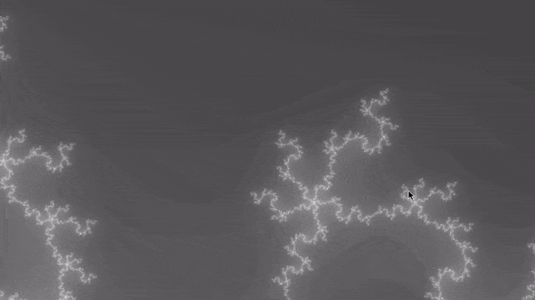

# PythonMandelbrotViewer

PythonMandelbrotViewer is an experimental mandlebrot viewer coded in Python 3.8 with zoom, movement, and screenshot functionality.




### Prerequisites

* Python 3.8 - https://www.python.org/downloads/release/python-380/

* pip (recommended for installing the other prerequsisites) - https://pip.pypa.io/en/stable/reference/pip_install/

* numba - http://numba.pydata.org
```
pip install numba
```

* pygame - https://www.pygame.org/news
```
pip install pygame
```

* numpy - https://numpy.org/
```
pip install numpy
```

### Installing

1. Install all needed prerequisites (Listed above)
2. Download the included PythonMandelbrotViewer.py file
3. Execute PythonMandelbrotViewer.py

End with an example of getting some data out of the system or using it for a little demo

### Controls
**Movement:** WASD

**Zoom in:** e
**Zoom out:** q

**Increase iterations:** r
**Decrease iterations:** f

**Take Screenshot:** t

## Authors

* **Randy Graham** - *Initial work*
* **Ryan Graham** - *Documentation and testing* - [Grahamr975](https://github.com/grahamr975)

## License

This project is licensed under the MIT License - see the [LICENSE.md](LICENSE.md) file for details
